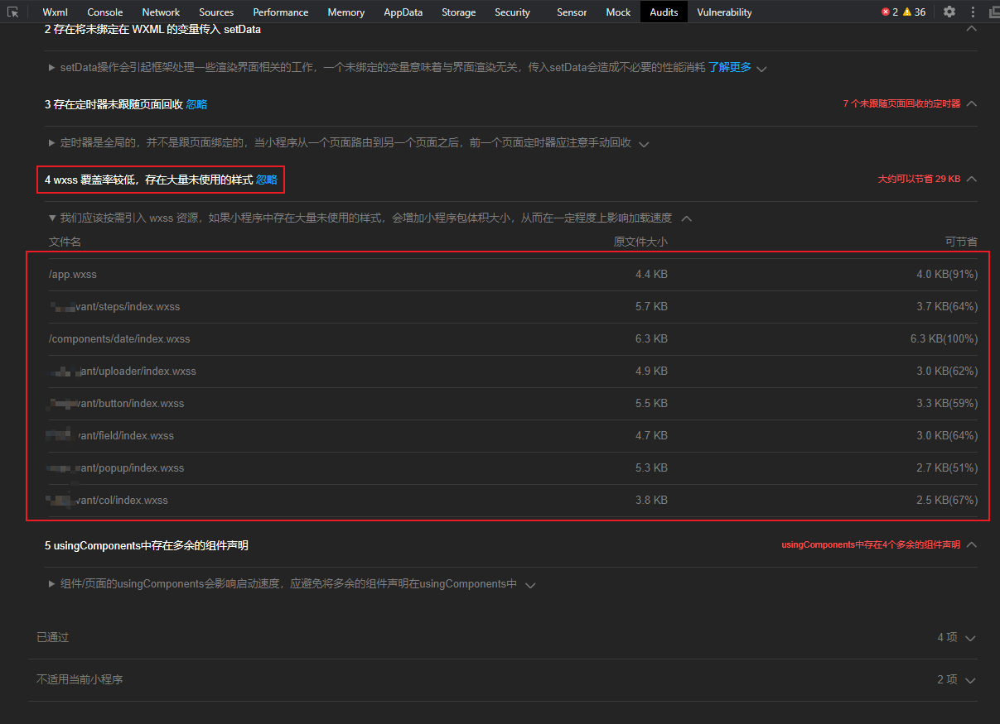

# unusewxss  
在微信小程序开发中经过多个版本的迭代之后，wxss中就会出现很多没有使用过的样式一直没有删除，在体验检查的时候微信开发者工具就会提示哪个wxss文件可以精减节省小程序包的大小加快小程序的加载进度


unusewxss用于快速查找微信小程序页面中wxss中声明的类样式在wxml中未使用的样式类，协助微信小程序删除多余无用的样式

## Installation
```
git clone https://github.com/momobeizi/unusewxss.git

npm install
```
## Examples
```js
 // 编辑index.js中的wxssPath,wxssPath路径
 // 注意/**/*.wxss不需要修改，只修改前面的文件路径

 const wxssPath = 'E:/xxxx/wx-xxx/pages/**/*.wxss'; // wxss文件的路径
 const wxmlPath = 'E:/xxxx/wx-xxx/pages/**/*.wxml'; // wxml文件的路径
 
 // 执行
 node index.js
```
## Output
```
第1个没有使用的类名: test  所在目录： E:\xxxx\wx-xxx\pages\xxxxx\index.wxss
第2个没有使用的类名: name  所在目录： E:\xxxx\wx-xxx\pages\xxxxx\index.wxss
```